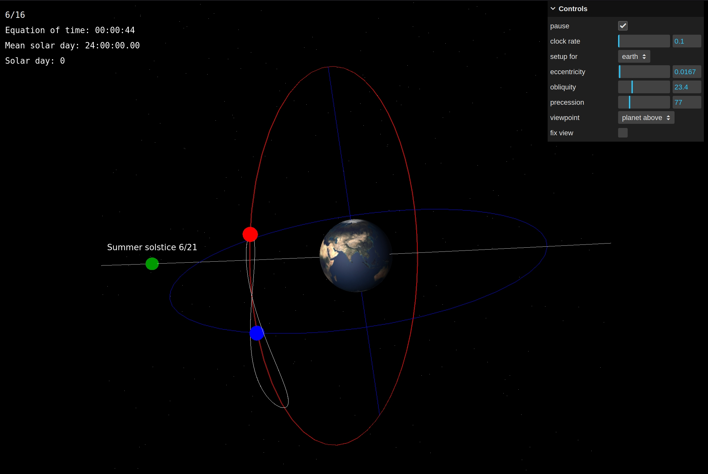

# Exploring the analemma with Three.js

What is the equation of time?

The earth's orbit is not perfectly circular, but elliptical, and the earth's axis of rotation is offset relative to the plane on which it orbits the sun. These are referred to as the eccentricity and obliquity of the earth's orbit. These two factors mean the time as measured by a sundial and the time as measured by our watches differ -- the length of a solar day varies throughout the year, while our watches continue ticking at a uniform rate. 

This difference is referred to as the 'equation of time', and it's easily observable, if you're patient and dedicated enough: if you take a photo of the sky at the same time every day for a year, the sun will walk around in the sky a little, owing to these variations and to the season. The shape it traces is known as the analemma. 

This Three.js app explores the relation between eccentricity, obliquity, the equation of time and the analemma. A [forthcoming] blog post will do a much better job of explaining all these concepts than the above short introduction.

